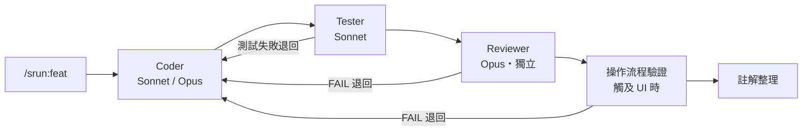

# specrun

> 為 Vue/Nuxt 專案打造的 Claude Code plugin — 一個指令跑完 Coder → Tester → Reviewer 的 SDD 工作流。

## 這是什麼

一句話：**把手動拼裝 SDD 流程的功夫，壓成一個指令。**

搭配 [OpenSpec](https://github.com/Fission-AI/OpenSpec) 管理變更規格，Reviewer 用獨立的 Opus subagent 幫你把關。

### 沒有 specrun，你得自己做這些

- 在 Coder / Tester / Reviewer 三個角色間切來切去
- 每個角色要載哪些 skill、依變更性質該用哪個模型，全靠自己記、手動載

這些都能編排，但每次手動拼裝真的很累。specrun 把 **agent 派發、skill 載入、獨立 review** 全包起來。

### 四個設計重點

| 重點 | 怎麼做 | 為什麼 |
|------|--------|--------|
| **Reviewer 看不到寫的人怎麼想** | Reviewer 是獨立 Opus subagent，只拿到 code、看不到 Coder 的推理過程 | 靠全新視角審查，避免自己寫自己審、被原本的思路帶著走 |
| **模型動態切換** | Coder 一般用 Sonnet；碰到架構變更、安全路徑、決策密集，或第 2 輪 retry 才升 Opus | 大部分改動不用 Opus，把錢花在刀口上 |
| **改動要分級** | 對話定案的小改動走 `/srun:fix`，做新功能才走 `/srun:feat` | 小改動不該被完整 spec 流程綁住 |
| **主對話不爆 context** | 每個角色都在自己的 subagent 裡幹活，只把結論回報主對話——過程的雜訊留在各自的 context | 主對話只累積結論、不累積過程，訊息不漏又不撞壓縮瓶頸，開發再長也不怕被截斷 |

### 預防勝於 retry

與其等 Reviewer 事後攔，不如從源頭少出錯：

- **`guidelines`** — Coder 動手前先載入行為守則（最小可行、外科手術式改動、自主判斷邊界），從生成端就避免過度設計和越界。
- **`/srun:decisions`** — 在 explore 和 propose 之間，先把還沒決定的細節一個個問清楚，避免模糊需求被包裝成看似完整的 spec、拖到寫程式時才爆出來。

## 核心流程



> 每個角色都是獨立 subagent。失敗會自動退回上一關修，修好再往下走。

## Features

### 指令

平常你只會下這三個 — 它們會自動編排底下的角色：

| 指令 | 什麼時候用 | 做什麼 |
|------|-----------|--------|
| **`/srun:feat`** `<change-name>` | 新功能、大型重構、跨模組變更 | 跑完整 pipeline，搭配 OpenSpec artifact |
| **`/srun:fix`** | 對話已定案、不需新 spec 的小改動（跨檔 bug、小 UI 調整、composable 微調） | 輕量 pipeline：先判斷 spec 影響 → Coder + Tester → 註解整理 |
| **`/srun:decisions`** `[任務描述]` | 需求還沒完全想清楚、怕有沒定案的細節被漏掉（完整新功能、全新 UI 流程） | 動手前先把還沒想清楚的地方一個個挖出來問你，整理成決策清單交給 `/opsx:propose`（不產 spec、不寫 code） |

還有一個 kit 回饋迴路指令：**`/srun:retro`** `[--archive]` — 記錄偏離事件到跨專案收件匣；`--archive` 聚類找模式、產出 kit 優化提案。

> **微調就別開 plugin 了** — CSS、文字、單行 fix 直接在主對話改最快。

### pipeline 內部跑什麼

`feat` / `fix` 跑起來，內部依序派發這幾個獨立 subagent。**其中三個也能單獨呼叫**（改完只想補一件事時很方便）：

| 階段 | 也能單獨呼叫 |
|------|-------------|
| Coder | — |
| Tester | — |
| Reviewer | `/srun:review` |
| 操作流程驗證 | `/srun:verify-flow` `[URL] [依據]` |
| 註解整理 | `/srun:comment` |

**Coder**（Sonnet / Opus）— 預設 Sonnet，判定為架構變更 / 安全路徑 / 決策密集時升 Opus；任一迴路進到第 2 輪修復就全程升 Opus（不再降回）。完成後自跑 lint + typecheck。`feat` 和 `fix` 共用同一套 skill 規範，差別只在流程，不在風格寬鬆度。

**Tester**（Sonnet）— 獨立稽核者：先照 spec 自己列「該驗什麼」（禁看測試檔，防被既有測試錨定），再對照補寫。測試失敗退回 Coder 修（最多 3 輪；Coder 也能引驗收依據申辯，改叫 Tester 修測試）。

**Reviewer**（Opus・獨立）— 用 `opus-reviewer` agent 派發（鎖 `model: opus`、無 Write/Edit）。一次審完 code quality / 安全 / 慣例 / spec 對齊。改到 `.vue` 樣式會加載 `web-design-guidelines` 補 a11y 檢查；安全路徑或升級模式下改用 adversarial prompt。

**操作流程驗證**（Sonnet，觸及 UI 時）— 在真瀏覽器點完 spec 設計的流程，只驗「走得完、不報錯、不中斷」和 spec 明文寫的元件。美感、間距、資料合理性留給人。壓軸執行，驗的一定是最終 code；FAIL（重現確認後）退回 Coder，修好走完靜態關卡再重驗。

**註解整理**（Sonnet）— 收尾用 fresh-eyes 清掉 AI 累積的冗餘註解。凡是讀命名 / 結構 / 鄰近檔就能回推的都算冗餘；只留跨越開發期仍成立的「為什麼」、JSDoc 和功能型指令（`eslint-disable` 等）。清完重跑 lint + 測試當安全網。

## Install

### 前置依賴

| 工具 | 用途 |
|------|------|
| [OpenSpec](https://github.com/Fission-AI/OpenSpec) | 管理 `openspec/` 變更 artifact（`/srun:feat` 需要變更目錄先存在） |
| [antfu/skills](https://github.com/antfu/skills) | 提供 pipeline 依賴的 Vue/Nuxt skill |

### 1. 裝外部 skills

pipeline 用的 skill 全來自 antfu/skills 這一個 repo。**注意 `antfu` 只是集合裡的其中一個 skill，不等於全部** — 一定要用 `--skill='*'` 一次裝齊：

```bash
pnpx skills add antfu/skills --skill='*' -g
```

skill 分兩層，建議一次全裝（換專案就直接受益）：

- **必載**（每次都載，缺一即停下回報）：`vue`、`vue-best-practices`、`nuxt`、`antfu`、`vitest`、`vue-testing-best-practices`
- **條件式**（依專案性質才觸發）：`pinia`、`unocss`、`antfu-design`、`vite`、`vue-router-best-practices`、`vueuse-functions`、`nitro`、`pnpm`、`turborepo`、`web-design-guidelines`

> 外部 skill 缺裝或改名時，agent 會**停下回報**，不會在沒慣例約束下硬寫（preflight 紀律）。

### 2. 裝 plugin

```bash
/plugin marketplace add jay123578951/specrun
/plugin install srun@specrun
```

### 3. 驗證

```bash
/plugin list          # 應看到 srun@specrun
ls ~/.claude/skills   # 確認必載 skill 都在
```

## 最小範例

```bash
/opsx:explore dark-mode       # 探索需求（可選）
/srun:decisions dark-mode     # 收斂未定決策（決策多時，可選）
/opsx:propose dark-mode       # 產出 proposal / design / tasks / specs

/srun:feat dark-mode          # Coder → Tester → Reviewer 一氣呵成
```

跑完人工驗收，最後 `/opsx:verify` → `/opsx:sync` → `/opsx:archive` → commit → merge。

## 專案慣例

UI 語言、設計系統、CSS 變數命名等專案特有慣例，寫在根目錄 `CLAUDE.md`。agent 派發前會自動讀，review 階段再引用一次。

## Feedback

Bug 或建議請開 [GitHub Issues](https://github.com/jay123578951/specrun/issues)。

## License

MIT — 見 [LICENSE](LICENSE)。變更紀錄見 [CHANGELOG.md](CHANGELOG.md)。
