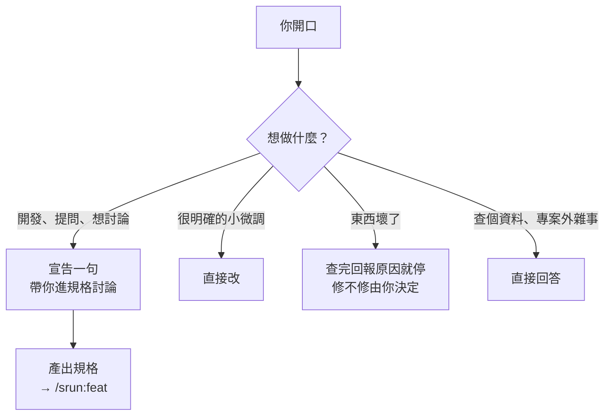
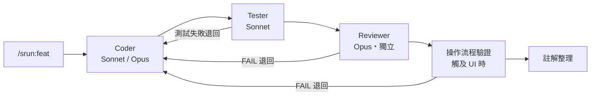

# specrun

> 一個指令跑完開發 → 測試 → 審查的 SDD 工作流 Claude Code plugin。核心 pipeline 與技術棧無關；知識型 skills 拆成 stack pack 選裝，裝哪包載哪包，沒有 pack 也走通用模式照跑。

## 這是什麼

**你開口的那一刻，該下的指令、該載的規範、該找的人，specrun 全接手，替你跑完一輪 SDD。**

- **入口** — 附一個開場 hook。你開口講需求，它替你判斷該走哪條路。
- **流程** — 改動分級：複雜項目走完整流程，小改動走輕量版，需求還沒想清楚就先把決策收斂完再動手。
- **品質** — 動手前先依專案技術棧載入對應的慣例 skill 當地板，寫完交給獨立審查把關。
- **回饋** — 跑偏的事件會被記錄、聚類，寫回。

## 入口引導

**最需要流程的時機，恰是你腦中沒有「輸入指令」意識的時刻**。specrun 附一個開場 hook，替你在入口判斷該走哪條路。



> 專案還沒接規格流程時，入口會改成問你想怎麼走。

## 核心流程



> 每個角色都是獨立 subagent。失敗會自動退回上一關修，修好再往下走。

## 五個設計重點

| 重點 | 怎麼做 | 為什麼 |
|------|--------|--------|
| **預防勝於 retry** | Coder 動手前先載入行為守則當地板；需求還沒收斂的，先進決策階段把細節問清楚再開工 | 事後攔一次的代價是退回、重寫、整條 pipeline 重跑——遠高於動手前多問幾句。Reviewer 是安全網，不該當第一道防線 |
| **Reviewer 看不到寫的人怎麼想** | Reviewer 是獨立 Opus subagent，只拿到 code 和 spec，拿不到 Coder 的推理過程，也聽不到他解釋「我為什麼這樣寫」 | 自己寫自己審，只會照著原本的思路找證據支持自己——會驗證，不會證偽。斷開 context 才是真正的第二雙眼睛，不是同一顆腦袋讀第二遍 |
| **模型動態切換** | Coder 一般用 Sonnet；碰到架構變更、安全路徑、決策密集，或第 2 輪 retry 才升 Opus | 大部分改動不用 Opus，把錢花在刀口上 |
| **改動要分級** | 對話已定案的小改動走輕量 pipeline，新功能才走完整 spec 流程；需求還沒收斂的，先進決策階段問清楚再動手 | 流程的成本要跟改動的風險成正比。小改動被完整 spec 綁住，你下次就繞過流程自己改了——流程一旦讓人想逃，它就失效了 |
| **主對話不爆 context** | 每個角色都在自己的 subagent 裡幹活，只把結論回報主對話——過程的雜訊留在各自的 context | 主對話只累積結論、不累積過程，訊息不漏又不撞壓縮瓶頸，開發再長也不怕被截斷 |

## 功能

### 指令

平常你只會下這三個 — 它們會自動編排底下的角色：

| 指令 | 什麼時候用 | 做什麼 |
|------|-----------|--------|
| **`/srun:feat`** `<change-name>` | 新功能、大型重構、跨模組變更 | 跑完整 pipeline，搭配規格 artifact |
| **`/srun:fix`** | 對話已定案、不需新 spec 的小改動（跨檔 bug、小 UI 調整、小型模組微調） | 輕量 pipeline：先判斷 spec 影響 → Coder + Tester → 註解整理 |
| **`/srun:decisions`** `[任務描述]` | 需求還沒完全想清楚、怕有沒定案的細節被漏掉（完整新功能、全新 UI 流程） | 動手前先把還沒想清楚的地方一個個挖出來問你，整理成決策清單交給 propose 階段（`/spectra-propose` 或 `/opsx:propose`），不產 spec、不寫 code |

還有一個 kit 回饋迴路指令：**`/srun:retro`** `[--archive]` — 記錄偏離事件到跨專案收件匣；`--archive` 聚類找模式、產出 kit 優化提案。

> **微調就別開 plugin 了** — CSS、文字、單行 fix 直接在主對話改最快。

### 流程內部跑什麼

`feat` / `fix` 跑起來，內部依序派發這幾個獨立 subagent：

#### Coder · Sonnet / Opus

- 預設 Sonnet；判定為架構變更 / 安全路徑 / 決策密集時升 Opus。任一迴路進到第 2 輪修復就全程升 Opus，不再降回
- 完成後自跑 lint + typecheck
- 動手前載入 `guidelines` 行為守則：能不寫就不寫、有現成的就別造新的、新裝套件是最後手段，一路砍到最小可行。但**砍有地板**——輸入驗證、錯誤處理、安全、無障礙，不准為了少改幾行而省；真的刻意走了捷徑，會在現場留註記說明簡化了什麼、什麼時候該還
- `feat` 和 `fix` 共用同一套規範——差別只在流程，不在風格寬鬆度
- 改動途中路過看到的問題（死碼、可疑邏輯、過時註解）會列進完成報告，但**回報，不順手動它**：那是給你的情報，不是待辦

#### Tester · Sonnet

- 獨立稽核者：先照 spec 自己列「該驗什麼」，再對照補寫
- **禁看既有測試檔**，防止被現成的測試錨定思路
- 測試失敗退回 Coder 修，最多 3 輪；Coder 也能引驗收依據申辯，改叫 Tester 修測試

#### Reviewer · Opus・獨立 · `/srun:review`

- 用 `opus-reviewer` agent 派發，鎖 `model: opus`、無 Write/Edit 權限
- 一次審完 code quality / 安全 / 慣例 / spec 對齊
- 改到 UI 元件的模板／樣式加載 `web-design-guidelines` 補 a11y 檢查；安全路徑或升級模式改用 adversarial prompt
- **會看走眼，所以能申辯**：被指出問題的一方可拿依據要求重審那一條（`feat` 限定），免得整條線被一個誤判卡死

#### 操作流程驗證 · Sonnet · 觸及 UI 時 · `/srun:verify-flow` `[URL] [依據]`

- 在真瀏覽器點完 spec 設計的流程，只驗「走得完、不報錯、不中斷」和 spec 明文寫的元件
- 美感、間距、資料合理性**留給人**
- 壓軸執行，驗的一定是最終 code；FAIL（重現確認後）退回 Coder，修好走完靜態關卡再重驗

#### 註解整理 · Sonnet · `/srun:comment`

- 收尾用 fresh-eyes 清掉 AI 累積的冗餘註解——凡是讀命名 / 結構 / 鄰近檔就能回推的都算冗餘
- 只留跨越開發期仍成立的「為什麼」、JSDoc 和功能型指令（`eslint-disable` 等）
- 清完重跑 lint + 測試當安全網

## 安裝

### 前置依賴

| 工具 | 用途 |
|------|------|
| **[spectra](https://github.com/kaochenlong/spectra-app)**（推薦） | 基於 OpenSpec 新增桌面 app 能視覺化追蹤，工作流指令優化 |
| [OpenSpec](https://github.com/Fission-AI/OpenSpec) | 把「這次要改什麼」寫成規格與任務清單 |

spectra 和 OpenSpec **挑一個裝就好**——做的是同一件事，寫出來的規格檔也通用。specrun 開場會自己認出你用哪一套，指令跟著換。

### 1. 裝 plugin

裝 `srun` 本體＋自己技術棧的 stack pack，知識型 skills 由 pack 的依賴自動連帶安裝。目前提供的 stack pack：

| Pack | 適用技術棧 | 需先 add 的 skills 來源 |
|------|-----------|------------------------|
| `srun-stack-vue` | Vue / Nuxt | `jay123578951/antfu-skills` |

以 Vue / Nuxt 為例：

```bash
/plugin marketplace add jay123578951/specrun      # srun 本體
/plugin marketplace add jay123578951/antfu-skills # 該 pack 的知識型 skills 來源
/plugin install srun@specrun                      # 核心 pipeline（stack 無關）
/plugin install srun-stack-vue@specrun            # stack pack，依賴自動連帶安裝
```

> 還沒有對應 stack pack 的技術棧：只裝 `srun@specrun`，pipeline 走通用模式（載 `guidelines` 行為守則）照跑。

### 2. 驗證

```bash
/plugin list   # 應看到 srun@specrun、你裝的 stack pack，及自動連帶安裝的依賴
```

## 最小範例

```bash
/spectra-discuss dark-mode    # 討論設計（可選）
/srun:decisions dark-mode     # 收斂未定決策（決策多時，可選）
/spectra-propose dark-mode    # 產出 proposal / design / tasks / specs

/srun:feat dark-mode          # Coder → Tester → Reviewer 一氣呵成
```

跑完人工驗收，最後 `/spectra-archive` → commit → merge。

> 用 OpenSpec 的話，把前兩個指令換成 `/opsx:explore`、`/opsx:propose`，收尾換成 `/opsx:verify` → `/opsx:sync` → `/opsx:archive`。

## 專案慣例

UI 語言、設計系統、CSS 變數命名等專案特有慣例，寫在根目錄 `CLAUDE.md`。agent 派發前會自動讀，review 階段再引用一次。

## Feedback

Bug 或建議請開 [GitHub Issues](https://github.com/jay123578951/specrun/issues)。

## License

MIT — 見 [LICENSE](LICENSE)。變更紀錄見 [CHANGELOG.md](CHANGELOG.md)。
