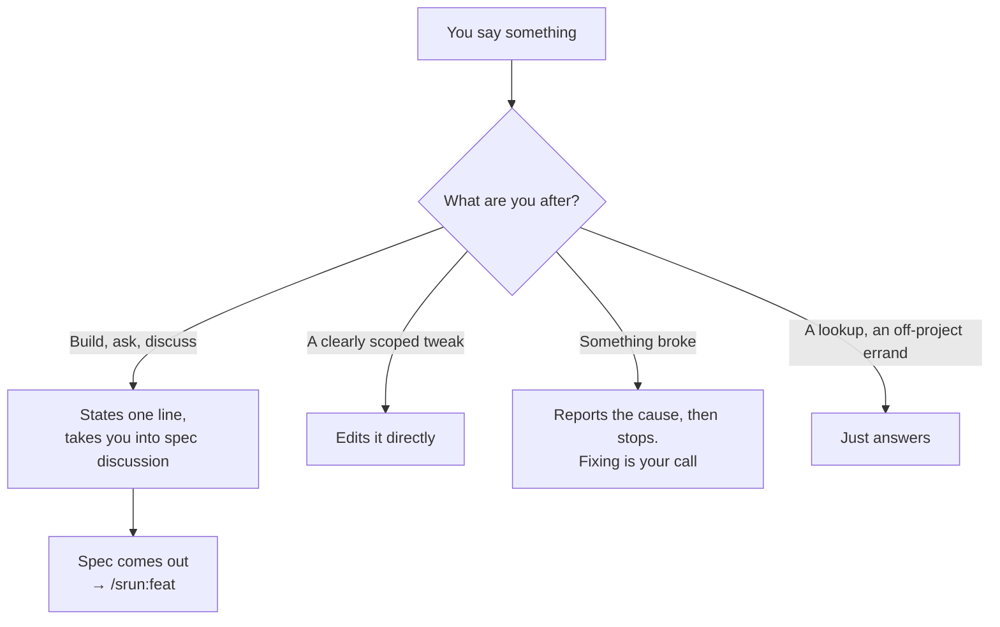
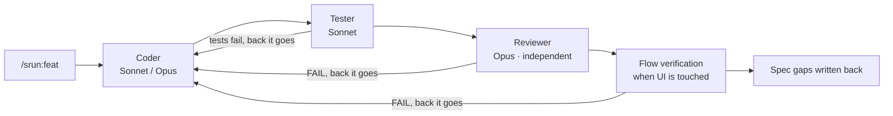

**English** · [繁體中文](README.zh-TW.md)

# specrun

> A Claude Code plugin that runs the whole spec-driven loop, code to test to review, off a single command. The core pipeline is stack-agnostic; stack conventions ship as optional packs that agents pick up on their own, and everything still runs without them.

## What it is

**From the moment you say what you want, specrun takes it from there: which command to run, which rules to load, which agent to hand it to.**

- **Entry**: a session hook reads what you just said and picks the path it belongs on.
- **Flow**: complex work takes the full pipeline, small changes take a light one. Cost tracks risk.
- **Quality**: what gets written is reviewed by an agent that never saw the author's reasoning.
- **Feedback**: runs that go off the happy path get recorded, clustered, and written back.

## Entry guidance

**You need the process most at the exact moment you aren't thinking about typing a command.**


```mermaid
flowchart TD
    U["You say something"] --> J{"What are you after?"}
    J -- "Build, ask, discuss" --> D["States one line,<br/>takes you into spec discussion"] --> P["Spec comes out<br/>→ /srun:feat"]
    J -- "A clearly scoped tweak" --> E["Edits it directly"]
    J -- "Something broke" --> B["Reports the cause, then stops.<br/>Fixing is your call"]
    J -- "A lookup, an off-project errand" --> S["Just answers"]
```

> On a project with no spec workflow wired up yet, the entry asks you which way to go instead.

## The pipeline


```mermaid
flowchart LR
    A["/srun:feat"] --> Coder
    Coder["Coder<br/>Sonnet / Opus"] --> Tester["Tester<br/>Sonnet"]
    Tester -- "tests fail, back it goes" --> Coder
    Tester --> Reviewer["Reviewer<br/>Opus · independent"]
    Reviewer -- "FAIL, back it goes" --> Coder
    Reviewer --> Verify["Flow verification<br/>when UI is touched"]
    Verify -- "FAIL, back it goes" --> Coder
    Verify --> Gap["Spec gaps written back"]
```

> Every role is its own subagent. A failure sends the work back a stage and it moves on once fixed. The whole run is laid out as a task list the moment it starts, so you can see which stage it's on. Tasks in `tasks.md` like "verify the screen" or "check completeness" never go to the Coder to grade its own work; they get checked off once the matching stage passes.

## Five design calls

| The call | How it works | Why |
| -------- | ------------ | --- |
| **Prevention beats retry** | The Coder loads behavioral guidelines as a floor before touching anything. Requirements that haven't settled go through a decisions pass first | Catching it afterwards costs a send-back, a rewrite, and a full pipeline rerun, far more than a few questions up front. The Reviewer is a safety net, not the first line of defense |
| **The Reviewer can't see how the author thought** | The Reviewer is a separate Opus subagent. It gets the code and the spec, never the Coder's reasoning, and never hears it explain "here's why I wrote it this way" | Grading your own work means hunting for evidence that supports the path you already took: you verify, you don't falsify. Cutting the context is what makes it a second pair of eyes rather than the same head reading twice |
| **Models switch on demand** | The Coder runs Sonnet normally, and moves up to Opus for architectural changes, security paths, decision-heavy work, or once a loop hits its second retry | Most changes don't need Opus. Spend it where it counts |
| **Changes get tiered** | Small changes already settled in conversation take the light pipeline; new features take the full spec flow. Unsettled requirements go through decisions first | Process cost has to track risk. Tie a small change up in a full spec and you'll route around the process next time. A process people want to escape has already failed |
| **The main thread never blows up** | Every role works inside its own subagent and reports back conclusions only. The noise stays in their own context | The main thread accumulates conclusions, not transcripts. Nothing gets dropped, nothing hits the compaction wall, and a long project never gets truncated |

## Features

### Commands

Day to day you only type these three. They orchestrate the roles underneath:

| Command | When to use it | What it does |
| ------- | -------------- | ------------ |
| **`/srun:feat`** `<change-name>` | New features, large refactors, cross-module changes | Runs the full pipeline against a spec artifact |
| **`/srun:fix`** | Small changes already settled in conversation, no new spec needed (cross-file bugs, small UI adjustments, minor module work) | Light pipeline: check spec impact → Coder (writes its own tests) → spec recheck |
| **`/srun:decisions`** `[task description]` | The requirements aren't fully thought through and you're worried an undecided detail will slip past (whole new features, brand-new UI flows) | Digs out the unsettled points one at a time and asks you, then hands a decision list to the propose stage (`/opsx:propose`). Produces no spec, writes no code |

One more, for tracking the kit's own guardrails: **`/srun:retro`** `[--archive]` records which guardrails fired on a feat/fix run and whether that stage passed, along with anything that went off the happy path, into a cross-project inbox. `--archive` computes each rule's fire rate and catch rate, proposing removal experiments for the stale ones and reinforcement for the ones that let something through.

> **Don't reach for the plugin on a tweak.** CSS, copy, a one-line fix: editing straight in the main thread is fastest.

### What runs inside

Once `feat` / `fix` starts, it dispatches these stages in order. The criteria behind each one, and why they were set that way, are in [docs/pipeline.md](docs/pipeline.md) (written in Chinese).

| Stage | Model | What it does | What sends it back |
| ----- | ----- | ------------ | ------------------ |
| **Coder** | Sonnet; moves to Opus for architecture / security / decision-heavy work, or on the second repair round | Writes code against the tasks, loads the `guidelines` rules before starting, runs lint + typecheck when done | A FAIL at any downstream stage lands here |
| **Tester** | Sonnet | Lists what should be covered from the spec alone, then fills the gaps. Barred from reading the existing test files | Failing tests send it back, up to 3 rounds; the Coder can push back and have the Tester fix the test instead |
| **Reviewer** · `/srun:review` | Opus, independent, no write access | Reviews code quality, security, conventions and spec alignment in one pass | FAIL sends it back; whoever was called out can cite evidence and ask for that one point to be re-reviewed |
| **Flow verification** · `/srun:verify-flow` | Sonnet, when UI is touched | Clicks through the flow in a real browser, checking it completes, throws nothing, and that the elements the spec names are present | A FAIL sends it back once reproduced |
| **Spec gaps written back** | Main thread does this itself | Takes the rules the Coder hit that the spec never covered, writes them into the delta spec, and lists them for you | Nothing goes back; you decide case by case at acceptance |

## Side tools

> Not on the pipeline, and you don't invoke them. Installing `srun` gets you them; whether to use them is per project.

### Work-item tracking (Beta) · `srun:roadmap`

When one big feature takes several passes, how to slice it, which part goes first, and what to watch out for now have somewhere to live before the first change even exists.

- **One file per item**, under `openspec/roadmap/`. The directory's presence is the on/off switch, and a project that doesn't want it gets asked once and never again
- **It disappears on its own**: opening a change moves the notes into `design.md`, and finishing the item deletes the file. It never grows without bound

### Comment cleanup · `srun:comment`

Run by hand over old human-written code or someone else's branch: anything the code itself already says gets deleted as redundant. What survives is the "why" that still holds after the development period, JSDoc, and functional directives (`eslint-disable` and friends have counts watching them, so there's no risk of losing one).

## Install

### 0. Prerequisites

| Tool | Required | What for |
| ---- | -------- | -------- |
| **[OpenSpec CLI](https://github.com/Fission-AI/OpenSpec)** | Yes | Turns "what we're changing this time" into specs and a task list. The engine the whole flow sits on; every `/opsx:*` command goes through it |
| [specrun desktop app](https://github.com/jay123578951/specrun-app) | No | A desktop view of your specs, reading the same files the OpenSpec CLI writes. Skip it and you read them in a text editor; the flow is unaffected |
| [Google Chrome](https://www.google.com/chrome/) | No | The browser flow verification actually drives. The playwright MCP bundled with `srun` uses your system Chrome, so there's no separate Playwright Chromium to install; the MCP package itself installs into the plugin data directory on first launch and needs no network after that. Without Chrome that stage is skipped and falls back to manual verification, which never blocks delivery |

Installing the OpenSpec CLI:

```bash
npm install -g @fission-ai/openspec@latest   # pnpm / yarn / bun / nix: see its README
```

Run `openspec init` once inside the project to create the `openspec/` directory, and `srun` will recognize on startup that this project runs the spec flow.

<table>
<tr>
<td width="80" align="center"></td>
<td>

**[specrun desktop app](https://github.com/jay123578951/specrun-app)** (same name as this kit, but a separate repo) lays the change list, specs and tasks under `openspec/` out on one screen, so you aren't `cd`-ing around reading markdown. The engine is entirely the OpenSpec CLI; the app only displays. Both are looking at the same files.

**Apple silicon Macs only.** On an Intel Mac it opens to "cannot be opened on this Mac".

</td>
</tr>
</table>

Install it from [Releases](https://github.com/jay123578951/specrun-app/releases), then remember to run this. Without it macOS blocks the first launch and claims the app is damaged:

```bash
xattr -d com.apple.quarantine /Applications/specrun.app
```

### 1. Install the plugin

Install `srun` itself plus the stack pack for your stack; the knowledge skills come along as pack dependencies. Pick a row below and substitute it into the four commands:

| Stack | `{pack}` | `{skills source}` |
| ----- | -------- | ----------------- |
| Vue / Nuxt | `srun-stack-vue` | `jay123578951/antfu-skills` |
| .NET / ASP.NET Core | `srun-stack-dotnet` | `dotnet/skills` (official; `backend-common` ships with this marketplace) |

```bash
/plugin marketplace add jay123578951/specrun   # srun itself
/plugin marketplace add {skills source}        # where that pack's knowledge skills come from
/plugin install srun@specrun                   # core pipeline, stack-agnostic
/plugin install {pack}@specrun                 # stack pack, dependencies come along
```

> No stack pack for your stack yet? Run just the first and third lines and it still works: the agents find no matching knowledge skill and fall back to the conventions in your project's `CLAUDE.md`.

### 2. Check it took

```bash
/plugin list   # should list srun@specrun, your stack pack, and the dependencies pulled in
```

## Minimal example

```bash
/opsx:explore dark-mode       # discuss the design (optional)
/srun:decisions dark-mode     # settle open decisions (optional, when there are many)
/opsx:propose dark-mode       # produces proposal / design / tasks / specs

/srun:feat dark-mode          # Coder → Tester → Reviewer, start to finish
```

Accept it by hand, then `/opsx:sync` → `/opsx:archive` → commit → merge.

## Project conventions

UI language, design system, CSS variable naming and anything else specific to your project go in the root `CLAUDE.md`. Agents read it before dispatch, and the review stage cites it again.

## Feedback

Bugs and suggestions: [GitHub Issues](https://github.com/jay123578951/specrun/issues).

## License

MIT, see [LICENSE](LICENSE). Changes are in [CHANGELOG.md](CHANGELOG.md) (written in Chinese).
