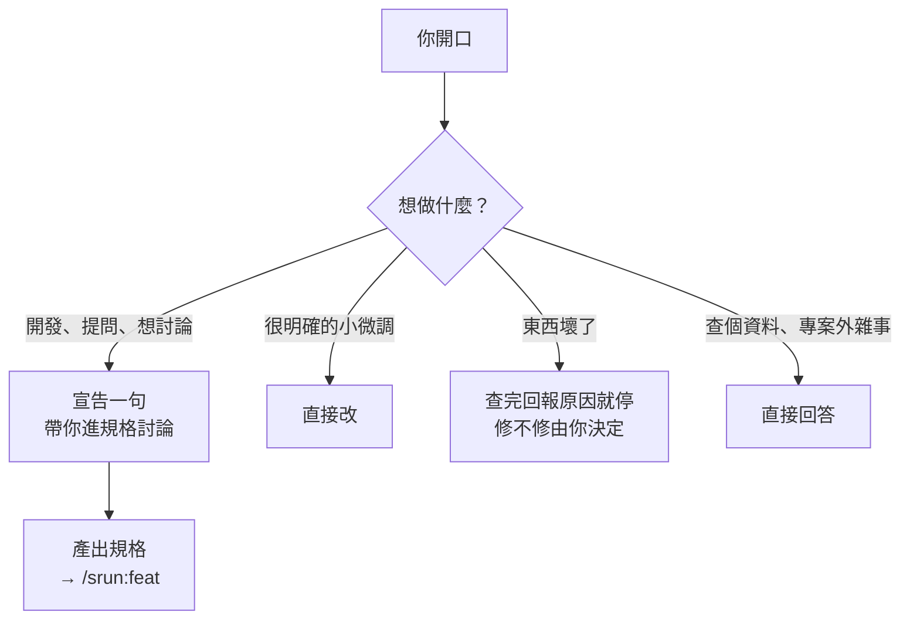
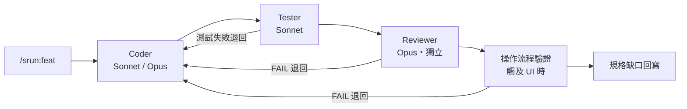

[English](README.md) · **繁體中文**

# specrun

> 一個指令跑完開發 → 測試 → 審查的 SDD 工作流 Claude Code plugin。核心 pipeline 不挑技術棧；慣例知識拆成 stack pack 選裝，裝了 agent 自己會挑著用，沒裝也照樣跑。

## 這是什麼

**你開口的那一刻，該下的指令、該載的規範、該找的人，specrun 全接手，替你跑完一輪 SDD。**

- **入口** — 附一個開場 hook，替你判斷這句話該走哪條路。
- **流程** — 複雜項目走完整流程，小改動走輕量版，兩者的成本跟風險成正比。
- **品質** — 寫完交給拿不到作者思路的獨立審查把關。
- **回饋** — 跑偏的事件會被記錄、聚類，寫回。

## 入口引導

**最需要流程的時機，恰是你腦中沒有「輸入指令」意識的時刻。**



> 專案還沒接規格流程時，入口會改成問你想怎麼走。

## 核心流程



> 每個角色都是獨立 subagent。失敗會自動退回上一關修，修好再往下走。整條流程起跑就列成 task 清單，隨時看得到跑到哪一關；tasks.md 裡「驗證畫面」「檢查完整性」這類 task 不會丟給 Coder 自己驗自己，等對應關卡過了自動幫你打勾。

## 五個設計重點

| 重點                            | 怎麼做                                                                                                        | 為什麼                                                                                                                      |
| ------------------------------- | ------------------------------------------------------------------------------------------------------------- | --------------------------------------------------------------------------------------------------------------------------- |
| **預防勝於 retry**              | Coder 動手前先載入行為守則當地板；需求還沒收斂的，先進決策階段把細節問清楚再開工                              | 事後攔一次的代價是退回、重寫、整條 pipeline 重跑，遠高於動手前多問幾句。Reviewer 是安全網，不該當第一道防線                 |
| **Reviewer 看不到寫的人怎麼想** | Reviewer 是獨立 Opus subagent，只拿到 code 和 spec，拿不到 Coder 的推理過程，也聽不到他解釋「我為什麼這樣寫」 | 自己寫自己審，只會照著原本的思路找證據支持自己：會驗證，不會證偽。斷開 context 才是真正的第二雙眼睛，不是同一顆腦袋讀第二遍 |
| **模型動態切換**                | Coder 一般用 Sonnet；碰到架構變更、安全路徑、決策密集，或第 2 輪 retry 才升 Opus                              | 大部分改動不用 Opus，把錢花在刀口上                                                                                         |
| **改動要分級**                  | 對話已定案的小改動走輕量 pipeline，新功能才走完整 spec 流程；需求還沒收斂的，先進決策階段問清楚再動手         | 流程的成本要跟改動的風險成正比。小改動被完整 spec 綁住，你下次就繞過流程自己改了。流程一旦讓人想逃，它就失效了              |
| **主對話不爆 context**          | 每個角色都在自己的 subagent 裡幹活，只把結論回報主對話，過程的雜訊留在各自的 context                          | 主對話只累積結論、不累積過程，訊息不漏又不撞壓縮瓶頸，開發再長也不怕被截斷                                                  |

## 功能

### 指令

平常你只會下這三個 — 它們會自動編排底下的角色：

| 指令                               | 什麼時候用                                                             | 做什麼                                                                                                                                     |
| ---------------------------------- | ---------------------------------------------------------------------- | ------------------------------------------------------------------------------------------------------------------------------------------ |
| **`/srun:feat`** `<change-name>`   | 新功能、大型重構、跨模組變更                                           | 跑完整 pipeline，搭配規格 artifact                                                                                                         |
| **`/srun:fix`**                    | 對話已定案、不需新 spec 的小改動（跨檔 bug、小 UI 調整、小型模組微調） | 輕量 pipeline：先判斷 spec 影響 → Coder（自寫測試）→ Spec 複核                                                                              |
| **`/srun:decisions`** `[任務描述]` | 需求還沒完全想清楚、怕有沒定案的細節被漏掉（完整新功能、全新 UI 流程） | 動手前先把還沒想清楚的地方一個個挖出來問你，整理成決策清單交給 propose 階段（`/opsx:propose`），不產 spec、不寫 code |

還有一個追蹤 kit 防錯規則的指令：**`/srun:retro`** `[--archive]` — feat/fix 完成時自動記下本次哪些防錯規則開了、開了之後那關過沒過，以及偏離事件，進跨專案收件匣；`--archive` 算各規則的開啟率與攔截率，過期的提拆除實驗、出事的提補強。

> **微調就別開 plugin 了** — CSS、文字、單行 fix 直接在主對話改最快。

### 流程內部跑什麼

`feat` / `fix` 跑起來，內部依序派發這幾關。每一關的判準、為什麼這樣定，見 [docs/pipeline.md](docs/pipeline.md)。

| 關卡 | model | 做什麼 | 什麼情況退回 |
| ---- | ----- | ------ | ------------ |
| **Coder** | Sonnet；架構／安全／決策密集或第 2 輪修復升 Opus | 照 tasks 寫 code，動手前載入 `guidelines` 行為守則，完成自跑 lint + typecheck | 下游任一關 FAIL 都退回這裡 |
| **Tester** | Sonnet | 照 spec 自列「該驗什麼」再補寫，禁看既有測試檔 | 測試失敗退回，最多 3 輪；Coder 可申辯改叫 Tester 修測試 |
| **Reviewer** · `/srun:review` | Opus，獨立、無寫入權 | 一次審完 code quality／安全／慣例／spec 對齊 | FAIL 退回；被指的一方可拿依據要求重審那一條 |
| **操作流程驗證** · `/srun:verify-flow` | Sonnet，觸及 UI 時 | 真瀏覽器點完流程，驗走得完、不報錯、spec 明文寫的元件在不在 | FAIL 重現確認後退回 |
| **規格缺口回寫** | 主對話自做 | 把 Coder 撞到的 spec 未交代規則寫進 delta spec，逐條列給你 | 不退回，驗收時你逐條決定收不收 |

## 周邊工具

> 不在 pipeline 上，也不用你下指令。裝了 `srun` 就有，要不要用每個專案自己決定。

### 開發項追蹤（Beta） · `srun:roadmap`

一個大功能要分好幾次做的時候，怎麼切、先做哪段、動手前要注意什麼，這些在第一個 change 開出來之前有地方放。

- **一項一檔**，放在 `openspec/roadmap/`。有沒有這個目錄就是開關，不想用的專案問過一次就不再問
- **它會自己消失**：開 change 時筆記搬進 `design.md`，整項做完檔案直接刪掉，不會愈長愈大

### 註解整理 · `srun:comment`

對人寫的舊 code、別人的 branch 手動跑：讀 code 本身就看得懂的一律當冗餘刪掉。只留過了開發期還成立的「為什麼」、JSDoc 和功能型指令（`eslint-disable` 這類有前後計數盯著，不怕誤刪）。

## 安裝

### 0. 前置依賴

| 工具                                                        | 必裝 | 用途                                                    |
| ------------------------------------------------------------ | ------ | ------------------------------------------------------- |
| **[OpenSpec CLI](https://github.com/Fission-AI/OpenSpec)**  | 是    | 把「這次要改什麼」寫成規格與任務清單。整套流程的引擎，`/opsx:*` 指令都靠它 |
| [specrun 桌面 App](https://github.com/jay123578951/specrun-app) | 否    | 看規格的桌面畫面，讀的是 OpenSpec CLI 寫出來的同一批檔案。不裝就用文字編輯器看，流程不受影響 |
| [Google Chrome](https://www.google.com/chrome/)             | 否    | 操作流程驗證（verify-flow）實際開的瀏覽器。srun 隨附的 playwright MCP 走系統 Chrome，不用另裝 Playwright 的 Chromium；MCP 套件本身第一次啟動會自動裝進 plugin 資料目錄，之後啟動不上網。沒有 Chrome 的話該關會跳過、退回人工驗證，不擋交付 |

裝 OpenSpec CLI：

```bash
npm install -g @fission-ai/openspec@latest   # pnpm / yarn / bun / nix 見它的 README
```

在專案裡跑一次 `openspec init` 建出 `openspec/` 目錄，`srun` 開場就會認出這個專案走規格流程。

<table>
<tr>
<td width="80" align="center"></td>
<td>

**[specrun 桌面 App](https://github.com/jay123578951/specrun-app)**（與這包 kit 同名，是另一個獨立的 repo）把 `openspec/` 目錄裡的變更清單、規格與任務攤成一個桌面畫面，省得一路 `cd` 進去翻 markdown。引擎完全是 OpenSpec CLI，它只負責顯示，兩邊看到的是同一份檔案。

限 **Apple 晶片的 Mac**。Intel Mac 下載後點開會說「無法在這台 Mac 上開啟」。

</td>
</tr>
</table>

1. 到 [Releases](https://github.com/jay123578951/specrun-app/releases) 下載最新的 `specrun_x.x.x_aarch64.dmg`，開啟後把 `specrun.app` 拖進「應用程式」
2. 開一次終端機，把 macOS 替下載檔案蓋上的標記拿掉：

   ```bash
   xattr -d com.apple.quarantine /Applications/specrun.app
   ```

3. 回「應用程式」點開 `specrun.app`

<details>
<summary>第一次開啟被系統擋下來？看這裡</summary>

**拿掉標記那一步不能跳過。** 這個 App 沒有經過 Apple 簽章，直接點開時 macOS 會說它「已損毀，應將其丟到垃圾桶」。那不是檔案真的壞掉，是系統擋下未簽章 App 時用的說法。同理，「隱私權與安全性」面板裡找不到 specrun、右鍵選「打開」也沒用，那兩條路只開放給有簽章的 App。

**那行指令執行成功時畫面上不會出現任何訊息**，游標跳回下一行就是做完了。看到 `No such xattr` 代表你指到的那份 App 身上沒有標記，多半是拖曳時卡在「已有同名項目」、實際沒換成新下載的那份，把舊的丟掉重拖一次。

</details>

### 1. 裝 plugin

裝 `srun` 本體＋自己技術棧的 stack pack，知識型 skills 由 pack 的依賴自動連帶安裝。從下表挑一列，代進四行指令：

| 技術棧              | `{pack}`            | `{skills 來源}`                                            |
| ------------------- | ------------------- | ---------------------------------------------------------- |
| Vue / Nuxt          | `srun-stack-vue`    | `jay123578951/antfu-skills`                                |
| .NET / ASP.NET Core | `srun-stack-dotnet` | `dotnet/skills`（官方；`backend-common` 隨本 marketplace） |

```bash
/plugin marketplace add jay123578951/specrun   # srun 本體
/plugin marketplace add {skills 來源}          # 該 pack 的知識型 skills 來源
/plugin install srun@specrun                   # 核心 pipeline，跟技術棧無關
/plugin install {pack}@specrun                 # stack pack，依賴自動連帶安裝
```

> 你的技術棧還沒有對應的 stack pack？只跑第一、三行也照樣用：agent 挑不到合用的知識 skill，就靠專案 CLAUDE.md 的慣例動手。

### 2. 驗證

```bash
/plugin list   # 應看到 srun@specrun、你裝的 stack pack，及自動連帶安裝的依賴
```

## 最小範例

```bash
/opsx:explore dark-mode       # 討論設計（可選）
/srun:decisions dark-mode     # 收斂未定決策（決策多時，可選）
/opsx:propose dark-mode       # 產出 proposal / design / tasks / specs

/srun:feat dark-mode          # Coder → Tester → Reviewer 一氣呵成
```

跑完人工驗收，最後 `/opsx:sync` → `/opsx:archive` → commit → merge。

## 專案慣例

UI 語言、設計系統、CSS 變數命名等專案特有慣例，寫在根目錄 `CLAUDE.md`。agent 派發前會自動讀，review 階段再引用一次。

## Feedback

Bug 或建議請開 [GitHub Issues](https://github.com/jay123578951/specrun/issues)。

## License

MIT — 見 [LICENSE](LICENSE)。變更紀錄見 [CHANGELOG.md](CHANGELOG.md)。
